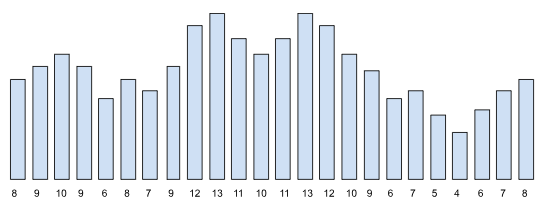
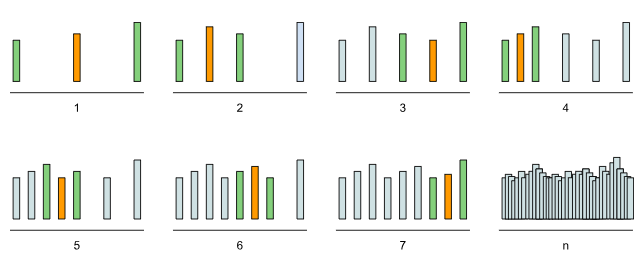
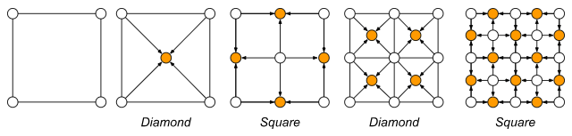

# Etapa 3 - Geração de um mapa de altitudes

### Pré-requisitos
Para a realização desta etapa, além dos conceitos das etapas anteriores, você deve estar a par de:
- Uso de um gerador de número aleatório.
### Conceitos iniciais
Há várias forma de gerar proceduralmente um mapa de altitudes. O algoritmo a ser implementado neste projeto é o **Diamond-Square** por ser um dos mais simples de entender/implementar, sem perda de eficiência. Ele é baseado no algoritmo de deslocamento de pontos médios, descrito a seguir.

#### Algoritmo de deslocamento do ponto médio (1D)
Vamos explicar o algoritmo *Diamond-Square* explicando inicialmente o de deslocamento de ponto médio aplicado a uma dimensão. Ou seja, vamos ilustrar inicialmente o algoritmo usando um array (array de altitudes), depois passamos para uma matriz (mapa de altitudes).

Considere um terreno que deve ser representado por um array de altitudes, onde cada ponto tem uma altura associada. Ou seja, cada valor em um índice do vetor representa uma altitude da montanha (ou contorno) em um intervalo discreto, como na figura abaixo, representado pelo array `[8, 9, 10, 9, 6, 8, 7, 9, 12, 13, 11, 10, 11, 13, 12, 10, 9, 6, 7, 5, 4, 6, 7, 8]`.

A ideia do algoritmo para gerar um terreno como esse é gerar altitudes aleatórias para as posições extremas do array e depois calcular a altitude do índice do meio (ponto médio) a partir da média das altitudes anteriores adicionada de um "deslocamento" (incremento ou decremento) aleatório.

Em seguida, aplicamos o mesmo procedimento para o intervalo à esquerda do ponto médio, e depois e à direita dele. Esse procedimento é então repetido (iterativamente ou recursivamente) até que não haja ponto central entre dois valores. A figura abaixo ilustra o processo. As barras verdes representam os extremos que serão usados e a barra laranja a altura do ponto médio calculado (média dos extremos mais um deslocamento aleatório).

#### Algoritmo Diamond-Square (2D)

O algoritmo de geração de terrenos *Diamond-Square* é similar ao processo explicado na seção anterior: o cálculo do ponto médio usará alturas já calculadas e adicionará um deslocamento aleatório. Porém, há algumas diferenças significativas:
1. Ao invés de um array, as alturas estarão dispostas em uma matriz (matriz de altitudes);
2. Ao invés de 2 pontos, geração da altura do ponto médio usará as alturas de até 4 pontos já calculadas;
3. Os 4 pontos a serem usados ficarão intercambiando entre 2 etapas:
	1. *Diamond*: usando pontos diagonais (losango);
	2. *Square*: usando pontos ortogonais (quadrado).

A figura acima ilustra 2 iterações do processo. Inicialmente, ele precisa gerar aleatoriamente as alturas dos 4 cantos do terreno (pontos extremos). Em seguida, realiza a etapa *Diamond*, fazendo com que a altura do ponto central da matriz seja gerada. Depois, realiza a etapa *Square*, fazendo com que as laterais sejam geradas.

Depois dessas duas etapas, teremos agora 4 subdivisões com as extremidades geradas, e o processo pode ser repetido para todas elas. Primeiro, calculando o ponto central através da etapa *Diamond*. Depois calculando as laterais usando a etapa *Square*.

Para ficar mais fácil de entender, considere um terreno representado por um mapa de altitudes 9x9, onde cada altura da matriz é especificada por um ponto no formato (linha, coluna).

Primeiro, você vai gerar aleatoriamente uma altura para os 4 cantos: (0,0), (0,8), (8,0) e (8,8). A partir disso, você realizar a etapa *Diamond*. Nessa etapa, as alturas de 4 pontos diagonais (os cantos da matriz) serão usadas para gerar a altura do ponto central. Ou seja, a altura do ponto (4,4) vai ser a média dos pontos (0,0), (0,8), (8,0) e (8,8) mais um deslocamento aleatório.

Depois, será a vez da etapa *Square*. Nessa etapa, as alturas de 4 pontos ortogonais (cima, baixo, direita e esquerda) serão usadas para gerar as alturas das laterais. Ou seja, considerando pontos no formato (linha, coluna):
- A altura do ponto (0,4) será a média da altura dos pontos à esquerda (0,0), à direita (0,8) e abaixo (4,4) mais um deslocamento aleatório. Veja que o ponto acima (-3,4) não é usado porque está fora do terreno.
- A altura do ponto (4,0) será a média da altura dos pontos acima (0,0), à direita (4,4) e abaixo (8,0) mais um deslocamento. Veja novamente que o ponto à esquerda (4,-3) não é usado porque está fora do terreno.
- Da mesma forma, a altura do ponto (4,8) é calculada usando as alturas dos pontos acima (0,8), à esquerda (4,4) e abaixo (8,8).
- Por fim, a altura do ponto (8,4) é calcula usando os pontos (8,0), (4,4) e (8,8).

Em seguida, aplicamos novamente *Diamond* e *Square* nas subdivisões geradas enquanto houver um ponto central nelas. Um detalhe importante é que, à medida que o algoritmo vai detalhando o terreno, o deslocamento aleatório deve ir diminuindo. Isso é importante para termos um terreno que não haja uma transição brusca entre a altura de um ponto e do seu vizinho. Isso é feito usando um fator de "rugosidade". Por exemplo, se esse fator for 0.5, a cada nova iteração do algoritmo (ou seja, depois que ele realiza as etapas *Diamond* e *Square*), o valor máximo (e o mínimo) do deslocamento aleatório cai pela metade. Então, as diferenças de alturas vão diminuindo à medida que os pontos vão se aproximando.

Outro detalhe importante é que, para que não haja arredondamento no cálculo dos índices do ponto central, as dimensões da matriz deve ser sempre uma potência de 2 mais 1 ($2^n + 1$, onde $n$ é um valor inteiro positivo qualquer). Ou seja, podemos ter terrenos 3x3, 5x5, 9x9, 17x17, 33x33 e assim por diante.

### Implementação
Defina um novo tipo de dado capaz de representar um terreno usando um terreno (usando um mapa/matriz de altitudes).  Os dados desse tipo devem ser privados, mas ele deve fornecer métodos públicos para:
- Gerar aleatoriamente um mapa de altitudes seguindo o algoritmo Diamond-Square, descrito acima. O método deve receber como parâmetros um valor inteiro N que será usado para calcular o tamanho da matriz de altitudes (será uma matriz quadrada de tamanho $2^N + 1$) e um fator de "rugosidade" a ser usado (ex: 0.5).
- Consultar a altitude a partir de uma coordenada (lin, col);
- Consultar a quantidade de linhas da matriz;
- Consultar a quantidade de colunas da matriz;
- Salvar a matriz de altitudes em um arquivo. Esse método deve receber o nome do arquivo a ser salvo. Lembre-se de salvar não apenas as altitudes da matriz, mas também suas dimensões, para que quando for necessário ler o arquivo, seja possível alocar uma matriz com as dimensões necessárias;
- Ler a matriz de altitudes de um arquivo. Esse método deve receber o nome do arquivo a ser lido. Veja que, se já houver uma matriz alocada. Esse método deve desalocar a matriz existente e alocar uma nova, com as dimensões informadas no arquivo.

Lembre-se que, além desses métodos públicos, a classe deve ter seu construtor e destrutor públicos. O construtor precisa alocar e inicializar a matriz de altitudes com valores *default*. Assim, ele pode receber como parâmetro um valor inteiro N, que será usado para calcular o tamanho da matriz de altitudes (lembre-se que as dimensões devem ser de tamanho $2^N + 1$). E o destrutor deve liberar toda memória que for alocada para a matriz.

Você pode implementar quantos métodos privados forem necessários para organizar melhor o teu código. Por exemplo, pode-se ter um método privado para realizar a etapa *Diamond* e outro para realizar a etapa *Square*.

### Testes
Para verificar se a classe do Mapa de Altitudes está funcionando corretamente, escreva testes para verificar se:
- Após criar um mapa de altitudes de tamanho 5x5, todas as células possuem os valores *default* esperados.
- Após salvar em um arquivo o mapa 5x5 criado anteriormente, os dados no arquivo correspondem ao esperado.
- Crie um arquivo com uma matriz de altitudes 3x3 e, após criar um mapa e ler os dados desse arquivo, as altitudes dos pontos correspondem aos especificados no arquivo.

Como a geração aleatória do mapa de altitudes é complicada de verificar a consistência do resultado (devido à aleatoriedade dos valores gerados), você pode fazer testes parciais.

Por exemplo, você pode criar um mapa 9x9 e inicializar os cantos com uma única altura e, em seguida, chamar o método de geração das altitudes com rugosidade 0.0, ou seja não vai ter deslocamento algum do ponto médio. Espera-se então que, no final do processo, todos as altitudes geradas sejam a mesma utilizada na inicialização.

Se isso não ocorrer, então você passa a testar o algoritmo passo-a-passo, executando inicialmente apenas 1 iteração do algoritmo. Daí, você verifica se após essa iteração apenas o ponto central e as laterais foram alteradas (não estão com os valores *default* inicializados no construtor).

Passando nesse teste, execute o mesmo procedimento com 2 iterações. Mais pontos devem ser alterados e devem corresponder aos definidos pelas etapas *Diamond* e *Square*. E assim por diante.

Esses testes são essenciais para você saber se está alterando os dados corretos.