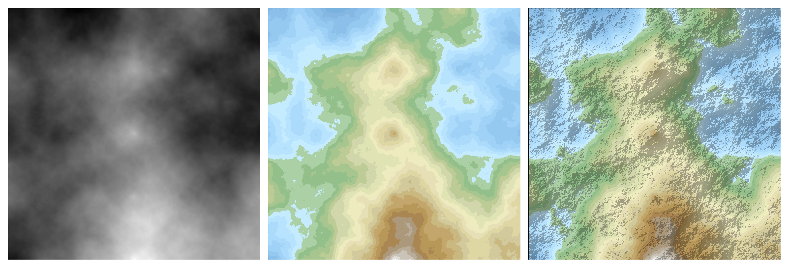
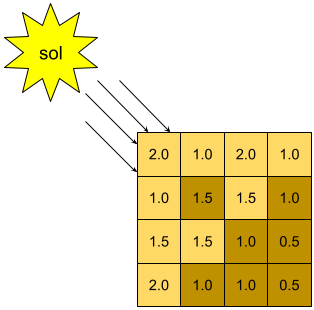

# Etapa 4 - Criação de imagens a partir de um mapa de altitudes

### Pré-requisitos
Para a realização desta etapa, além dos conceitos das etapas anteriores, você deve estar a par de:
- Argumentos em linha de comando

### Conceitos iniciais
Nessa etapa do projeto, você irá juntar os diferentes módulos implementados (paleta de cores, imagem e mapa de altitudes) em um programa capaz de gerar imagens de um terreno gerado aleatoriamente.

Há várias formas de criar uma imagem a partir de um mapa de altitudes. Podemos gerar desde imagens 3D realistas a imagens 2D (vista do alto). Mesmo com visão 2D, podemos gerar diferentes imagens. A figura abaixo ilustra 3 imagens geradas a partir do mesmo mapa de altitudes. A primeira é uma escala de cinzas, a segunda usa uma escala de cores para indicar a altitude e a última simula iluminação.  Todas são visões de cima para baixo do terreno e têm as mesmas dimensões do mapa de altitude, uma vez que há uma correspondência direta entre um ponto da matriz de altitudes e um pixel da imagem.

A imagem à esquerda é gerada normalizando todos as alturas da matriz no intervalo \[0; 255\] (ou seja, a menor altura passa a valer 0, a maior passa a valer 255 e as demais são valores interpolados entre 0 e 255) e criando pixels com os componentes RGB iguais a esse valor. Assim, quando mais escuro mais baixo, e quanto mais claro mais alto.

A imagem do meio é gerada usando uma escala de cores, na qual cada cor de uma paleta está associada a um intervalo de altura. A imagem abaixo ilustra uma escala. Nessa escala, se a altitude de um ponto estiver entre 0 e 10, a cor azul escura será usada, se estiver entre 10 e 20, será o azul claro, e assim por diante.

A imagem à direita é similar a do meio, já que usa uma escala de cores. Porém, é inserido um "sombreamento", dando uma ilusão de luminosidade para detalhar mais a visão do terreno. E é este tipo de imagem que faremos neste projeto.

Para criar esse efeito de luz/sombra, precisamos verificar, para cada pixel, se vai ser necessário escurecê-lo ou não. A ideia é considerar que o sol (fonte de luz) encontra-se na direção Noroeste (cima-esquerda). Assim, a luz que ele emite deixa os pontos do sudeste (baixo-direita) que têm uma altitude menor na "sombra". A figura abaixo ilustra isso através de uma matriz de altitudes em que as células que possuem altitude menor que a da célula superior-esquerda são "sombreadas".

Para "sombrear" um pixel, basta "escurecer" sua cor. Isso é feito reduzindo os valores RGB do pixel em uma determinada proporção. Por exemplo, digamos que um pixel tenha cor RGB = (113, 171, 216), se o fator de redução for 0.5, o pixel será "escurecido" para RGB = (56, 85, 113).

### Implementação
Altere a classe que representa um mapa de altitudes (criada na etapa 3) adicionando um novo método público. Esse método deve receber uma paleta de cores (criada na etapa 1) e retornar uma imagem (criada na etapa 2).

O método deve criar uma imagem dinamicamente e definir os valores de seus pixels em função da sua altura do ponto correspondente na matriz de altitudes (usando a escala de cores passada por parâmetro), bem como escurecendo o pixel caso sua altura seja menor que a altura do ponto superior-esquerdo.

Crie um novo arquivo .cpp com a função principal do programa. Para gerar a imagem, o programa deve pedir ao usuário dados como:
- O nome do arquivo contendo a paleta de cores a ser usada na imagem;
- O tamanho do mapa de altitudes a ser gerado (e consequentemente o tamanho da imagem). Você pode pedir um valor $N$ e criar o mapa com tamanho $2^N + 1$.
- O nome do arquivo da imagem PPM a ser salvo.

### Testes
Para verificar se a imagem está sendo gerada corretamente, crie:
1. um arquivo com uma paleta de cores simplificada (3 cores, no máximo) e alturas bem definidas (por exemplo, 10, 20 e 30).
2. um arquivo com um mapa de altitudes de tamanho 9x9 com valores no intervalo estabelecido na paleta de cores (item anterior).
Em seguida, gere uma imagem a partir desses arquivos (você deve ler o arquivo com o mapa de altitudes), inicialmente sem aplicar o sombreamento.

Se a imagem corresponder ao esperado, altere o código para aplicar o sombreamento e verifique se os pontos que devem estar mais escuros correspondem ao esperado.

Dando certo, altere novamente para gerar uma imagem de tamanho maior e usando uma paleta de cores mais complexa, como a fornecida no projeto. Verifique então se a imagem é consistente com um terreno.
